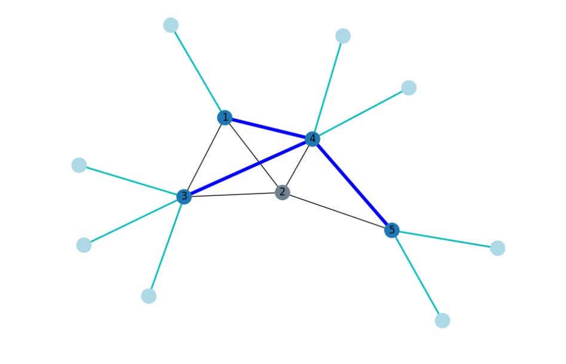

# Network Digital Twin: bandwidth control for energy saving

This project is the subject of the final dissertation for the MSc in Computer Science at University of Trento, Italy.

The final elaborate is titled “***Implementing and running the Digital Twin of a network for energy consumption monitoring and optimization***” and covers three main topics:

- The problem of energy consumption in network architectures
- Proposal of the structure of a Digital Twin of a network for traffic monitoring and energy-wise optimization
- Development of the prototype of the D.T. and results achieved

### The problem of energy consumption

When speaking about the costs of a network, we can divide them into two main parts: the capital expenditures (CapEx) and the operational expenses (OpEx). Various >10 years projections estimate that in general the OpEx can amount to as much as 9 times the CapEx.

In particular, many reports show that an important part of the OpEx is due to the cost of energy needed by the network. This slice usually ranges between 15% and 50%.


The energy can be further divided in two parts: that needed by the structures (e.g. lighting in datacenters, cooling systems, etc.) and that needed by the network devices in order to work.

It has been observed that up to half of the energy consumption of a general network device (e.g. switch) is due to the number of active interfaces. More in details, studies [[1]](https://ieeexplore.ieee.org/abstract/document/4509688) [[2]](https://doi.org/10.1007/978-3-642-23041-7_28) demonstrated that the amount is strictly related to the working bit rate of each port, while being almost independent of the amount of traffic traversing it. In other words, once a cable is inserted in an interface and the LED status lights up, that port is consuming energy.

If we define as *idle* the interfaces that are active (i.e. wired and up) but aren’t forwarding any traffic, it sounds logical that putting them in a temporary sleep mode or lowering their bit rate could be effective in terms of energy saving. In fact, some mechanisms for per-interface sleeping already exist (ALR and LPI), however the problem is that the device should be aware of them, otherwise the modified, and unsupported, L2 frame would cause the packet to be dropped.

Software Defined Networking offers the tools needed to exploit such strategies in a way that could be hardware independent, provided that the switches/routers support the SDN paradigm.

In conclusion, the ultimate goal of this project is to propose a way of implementing and running the Digital Twin of a network in order to:

- monitor the traffic per-interface
- adapt the bit rate of each interface depending on the traffic volume

In particular, the Digital Twin proposed is developed in a modular way, so that any optimization algorithm can be developed and easily integrated with the data structures composing the Digital Twin itself.

[More on energy consumption in networks.](./more_on_energy.md)

### The Digital Twin

#### What is a Digital Twin?

A digital twin is a real-time simulation of a real-world system (physical twin). The digital twin serves as a counterpart of the real twin and allows for modeling present and future scenarios based on a model that is constantly updated with real and live data.

Digital Twins are used in a large number of areas, from the aerospace industry to economics. This project focuses on a possible use in the telecommunications field.

One of the biggest challenges when developing a Digital Twin is dealing with the huge amount of data a system can generate. It is important to clearly define what the goal is, so that the effort is focused only on the needed data: bigger quantities require bigger resources to allow for real-time gathering and analysis.

#### The main idea

The main idea at the core of this project is that the Digital Twin can be seen as a puzzle: at the base there are the data structures and the main code, and on top of it routing, monitoring and optimization algorithm can be easily integrated.


Despite the main goal being that of providing a solid and efficient “base piece” of the puzzle, in combination with the monitoring “piece”, I also developed some simple algorithms addressing the routing and the actual optimization problem, so to have a complete software that can be run in order to gather some results from testing environments.

#### Representing the network

The biggest problem when developing a D.T. is to find a smart way of representing the real system, that highlights just the features of interest. Since we need to act on the single interfaces in order to optimize their energy consumption, what I propose is an “interface-centric” model of the network.

The first and most complete way I came up with was that of representing the network as a graph where each node was an interface, and then cluster them up depending on the belonging to the switches. However this would be too complex to handle with large interfaces, so in the end the network is represented by a graph where the switches are the nodes, but what is important is the list of edges. Each edge, which represents a couple of wired ports, is then enriched with information that is interface specific. Ultimately all of this is what is stored and constantly updated in the data structures composing the D.T.


#### Routing, monitoring and optimization

As anticipated, all the pieces of the puzzle were implemented in order to have a functioning D.T. prototype.

Since a generic mesh topology will be used as testbed, it is necessary to break the loops in the network in order for it to work. To do so, a simple way of calculating the spanning tree was implemented. The spanning tree of the network is defined via a BFS visit of the graph, with the root being chosen as the switch that has the highest number of connections to other switches (its degree), combined with an important number of connections to terminal hosts. This is an attempt at having as few active links as possible, in order to maximize the energy saving with relation to usage.

The execution of the BFS-ST allows for the first definition of the interfaces’ status: they are now either in `disabled` or `idle` state. The status of an `idle` interface may change to `working` or `saturated` during the execution of the D.T. The difference between `working` and `saturated` is that a saturated port is a port that is working above a certain threshold of traffic volume.

Such threshold is defined as $\text{SENSITIVITY} \cdot \text{port\_speed}$ where *SENSITIVITY* is a percentage decided a priori of the amount of traffic exchanged in a time unit at 1Mbps. E.g. if the digital twin time unit lasts 1 second and it is decided that if the link is half full , it needs more bitrate, the sensitivity will be 62500 B (50% of 1Mbps in 1s).

The status of the port, updated at each time unit based on the traffic monitoring, together with the amount of time a port has been in that status, determine if its bit rate must be changed.

The logic at the base of the optimization algorithm is greedy and kind of naive, and can be summed up as follows:

- port_status = *working* $\rightarrow$ keep current bit rate
- port_status = *saturated* $\rightarrow$ more bit rate
- port_status = *idle* $\rightarrow$ minimal bit rate

The choice when the port status is idle was either between 0 bit rate (sleep mode) or minimal, but since the energy required in the second case is very low, it was chosen to keep the link alive for availability of service.

As anticipated, also the amount of time spent in a certain status is considered. It is important to find good values for it (or a good strategy to determine them) in order to have a D.T. that is just as reactive as needed.

Just to give an example of what the wrong values may cause, let’s consider the case where the D.T. gives more bit rate as soon as the status changes to *saturated*: if it is just a local peak that ends in the span of a single time unit, giving more bit rate would be a waste of energy since the link was already capable to handle the flow.


**TO DO:** implement additional logic that allows for “going back”, something like the following pseudocode:

```pseudocode
if port.status == working then
	lower_threshold = port.bitrate[step_down] * SENSITIVITY
	if traffic_volume > lower_threshold then
		keep current port bitrate
	else
		lower port bitrate by one step
```

this way the previous statement 

> port_status = *working* $\rightarrow$ keep current bit rate

becomes

- port_status = *working* $\rightarrow$ keep current bit rate OR lower bit rate by one step

### Actual implementation and test execution


Since I didn’t have a real physical network to test the execution of the Digital Twin, I emulated one using Mininet, an open-source framework for network architectures emulation that supports the SDN paradigm.

I then used Ryu as SDN controller and in the end the Digital Twin is one of the SDN applications that execute on top of the controller.

**DISCLAIMER** - Mininet comes with an important limitation: the physical interfaces are emulated by virtual Ethernet interfaces, and the speed of this kind of interfaces is hardcoded in the Linux kernel to be 10 Gbps ([source](https://mailman.stanford.edu/pipermail/mininet-discuss/2015-January/005633.html)). Since it would be impractical to modify the Linux kernel, the solution proposed uses traffic control and quality of service mechanisms to emulate the actual change of bit rate of the interfaces.

The following diagram shows the main code flow of the developed Digital Twin, highlighting how the data structures are updated and used in the decision-making process.


The software was developed in Python and interacts with the SDN controller via the REST API that Ryu provides.

#### Simulation parameters

In order to estimate the energy required by each port at a certain bit rate, I used the table provided in [this](https://doi.org/10.1007/978-3-642-23041-7_28) paper (and shown below). The values are really close to real ones that can be estimated by averaging the data sheets of various commercial switches by real vendors.

| Bit rate           | Power per interface (ethernet) |
| ------------------ | ------------------------------ |
| 10 Mbps            | 0.1 W                          |
| 100 Mbps           | 0.2 W                          |
| 1000 Mbps (1 Gbps) | 0.5 W                          |
| 10 Gbps            | 5.0 W                          |

All the simulation runs were executed under the same “external” conditions:

- 60 cycles (cycle duration ~ 3’’)
- same traffic pattern and volume (emulated via iPerf)
- same network topology (BFS-ST always returns the same result)
- Base power for each switch: 20 W - just for plotting reasons (aesthetics...)

The figure below shows the topology used. The blue links are those that get selected by BFS-ST. Notice how no links are selected towards switch 2: this happens because it would be a leaf (connected to s4) with no terminal hosts, and no traffic should be routed through it. For this reasons, the digital twin can command to put it in sleep mode. 



In the following paragraphs I present the results achieved in the 4 most significant runs.

| # RUN | INITIAL SPEED | ADAPTIVE BITRATE | DISABLE UNUSED | MAX 10Gbps |
| ----- | ------------- | ---------------- | -------------- | ---------- |
| 1     | 100 Mbps      | False            | False          | False      |
| 2     | 1 Gbps        | False            | False          | False      |
| 3     | 10 Mbps       | True             | True           | True       |
| 4     | 10 Mbps       | True             | True           | False      |

Runs 1 and 2 are “traditional” runs: here the Digital Twin is used just for routing (execution of BFS-ST) and monitoring of traffic. No optimization in terms of bit rate adaptation/energy saving is performed.

Runs 3 and 4 use the Digital Twin at its full potential: all unused interfaces and devices are disabled, and the bit rate changes w.r.t. traffic volumes.

Run 1 is a bit “anachronistic”, 100 Mbps links are becoming less and less used each passing day, but could still be used in some households or very small offices.

Run 2 has one of the most common setup in the majority of households and offices, with 1 Gbps links. Run 4 is its optimized counterpart.

Run 3, whose results are strongly influenced by the energy required by 10 Gbps links offers some interesting insights, that will soon become clear.

##### Raw data about energy consumption

The graph below shows the energy required by the network during the simulation. Notice that for the traditional runs the value is constant, while the others are variable: in particular, notice that the run at max 10 Gbps goes to minimum power shortly after the 30th cycle: this is because it provides much more throughput than the others (e.g. run 4 “finishes” around cycle 50) and runs out of traffic to forward (remember that traffic pattern is fixed).


The average power required by both the optimized runs are way lower than the traditional ones, in particular that of run 4 is >20% lower than its counterpart run 2. However, we must remember that one switch is “asleep” in the optimized runs, lowering both averages by 20.2 W (base power plus the interfaces at 10 Mbps on both s2 and s4).

What happens if we compare runs 2 and 4, “awaking” switch 2?


We still obtain a saving of ~ 9%, with a measured throughput that is almost level between the two runs (~ 4% difference). The average energy needed by Run 4, with s2 alive, is comparable to that of Run 1, while offering 10 times the speed of it.

Doing the same with Run 3, we would obtain an average energy required higher than both Run 1 and Run 2.

However, it is clear that the network topology and the traffic pattern may strongly influence the results, when speaking of raw energy values. In order to have a fairer measure, that is as independent as possible from the “external” factors, I propose the following graph, which depicts the Watts per Gigabyte. In other words, the amount of energy  that is used to transfer 1 GB of data in the network per time unit.


We can notice that at the beginning the values are really high: this is due to the disproportion between the limited number of packets exchanged during the execution of BFS-ST and the bit rate of the interfaces that, in the best case of 10 Mbps, is still exaggerated if compared to the amount of traffic passing through the network.

The curves level out once traffic volume stabilizes in relation to the used bit rate. The peaks in the graph related to Run 3 (labeled as "Adaptive 10M-10Gbps") can be traced back to the moments when links working at a full speed of 10 Gbps experience a sudden decrease in traffic volume due to a flow ending. The same phenomenon is common to the curve of Run 4 to a lesser extent.

Once again, Run 4 achieves the best result, while Run 3, that in terms of raw energy would be the worst, scores better than both the traditional runs. Run 1, that requires a really low amount of power, is in fact the worst because of its lack of performance.

The table below shows a sum up of the results shown up until here.

| Run  | Bit rate range  | Unused ports | Base power | Switches (active) | Avg power (+20.2 W if needed) | Average W/GB |
| ---- | --------------- | ------------ | ---------- | ----------------- | ----------------------------- | ------------ |
| 1    | Fixed 100Mbps   | Powered      | 20 W       | 5 (5)             | 104.8 W                       | 53 W/GB      |
| 2    | Fixed 1Gbps     | Powered      | 20 W       | 5 (5)             | 112 W                         | 23 W/GB      |
| 3    | 10Mbps - 10Gbps | Shutted      | 20 W       | 5 (4)             | 99 W (119 W)                  | 21 W/GB      |
| 4    | 10Mbps - 1Gbps  | Shutted      | 20 W       | 5 (4)             | 83 W (103 W)                  | 15 W/GB      |
| -    | Fixed 10Gbps    | Powered      | 20 W       | 5 (5)             | 240 W (estimated)             | -            |

I conclude this brief exposition of this project with some food for thoughts. I estimated the power that would be needed by the traditional counterpart of Run 3
$$
100 \text{ W} + 5.0 \text{ W}\cdot 28 = 240 \text{ W}
$$
where 28 is the number of all wired ports in the topology used. Although 20 W of base power may be too few for a switch operating 10 Gbps links, we can still notice a difference of ~ 120 W in the part of energy bound to the interfaces, and this in the span of a 3 minutes simulation.

The result is still influenced by the “shape” of traffic? Absolutely yes.

So what’s the point of it? *Not all networks are built equal*, in particular not all network architectures are used at full power 24/7. Imagine part of a network infrastructure that is used just to perform regular backups of systems: the backups are executed during lunch time, the operations last about 45 minutes and require 10 Gbps links. In a traditionally run network, what happens for the remaining 23 hours and 15 minutes? How much energy is wasted?

That of backup is a too particular case? It is unreasonable that such links are used just for it? Ok, let’s try with something more realistic then...

Imagine a local ISP that also hosts and offers some services to its customers. The web sites hosted by it are widely used during office hours (suppose 8 am to 6 pm), while they experience just a handful of requests in the rest of the 24 hours. By using a Digital Twin like the one proposed, despite the greedy and naive optimization algorithm, the services would be accessible with highest possible throughput during daytime, while still being available during nighttime at a much lower energy cost. 

As a matter of fact, when dealing with network infrastructures, there is no bullet-proof solution, since they are designed and realized in order to meet specific requirements depending on the desiderata of the stakeholders, the available resources of the service provider, and, last but not least, the quality of service that the end user should experience.

Here lies the strength of the proposed Digital Twin: the routing and optimization algorithms are independent entities that are executed on the digital twin and just need to interact with the few data structures used to maintain the model of the network. Since the development followed the principles of object-oriented programming as much as possible and the functions for routing and bit rate adaptation have been kept as detached as possible from the main code, they can be substituted by more suited ones. 

All of this results in a Digital Twin that is easily maintainable and integrable with any algorithm of choice.

